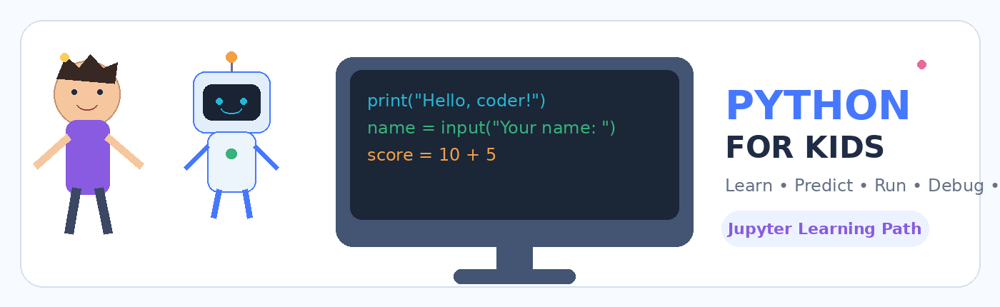

## 🌍 About This Project

**Python for Kids – Persian Edition** is a visual, interactive, and project-based Python programming course designed for children and teenagers ages **10–16**.

The course starts from absolute beginner concepts and gradually introduces students to problem-solving, algorithms, variables, data types, strings, conditions, loops, lists, and real Python projects.

Each lesson is provided as a **Jupyter Notebook** and follows a hands-on learning approach:

**Learn → Predict → Run → Modify → Debug → Build**

The lessons are written in **Persian (RTL)**, while Python code follows the standard left-to-right format. Visual illustrations use English labels to ensure consistent rendering across different systems.

### ✨ Course Features

* Beginner-friendly Python lessons
* Interactive Jupyter Notebooks
* Visual explanations and diagrams
* Coding challenges
* Debugging exercises
* Mini-projects
* Project-based learning
* Designed specifically for ages 10–16
* Persian explanations with standard Python code

> No previous programming experience is required.

# 🐍 ماجراجویی در دنیای پایتون

**دوره پروژه‌محور Python برای کودکان و نوجوانان ۱۰ تا ۱۶ سال**

الگوی ثابت دوره:

**یاد بگیر → حدس بزن → اجرا کن → تغییر بده → باگ پیدا کن → پروژه بساز**

> تصاویر آموزشی داخل خود فایل‌های `.ipynb` به‌صورت PNG Attachment قرار دارند و یک نسخه جدا نیز در پوشه `images/` نگهداری می‌شود. متن داخل تصاویر انگلیسی است تا مشکل فونت فارسی ایجاد نشود؛ توضیحات اصلی درس فارسی و RTL هستند.

---

## 🗺️ جلسات فعلی

| جلسه | موضوع | پروژه / تمرین اصلی |
|---|---|---|
| 01 | الگوریتم، شبه‌کد و فلوچارت | طراحی الگوریتم |
| 02 | `print`، `input` و متغیر | کارت معرفی |
| 03 | کامنت، `f-string`، انواع داده و خطا | کارت بازیکن |
| 04 | عملگرها و توابع ریاضی | تمرین‌های ریاضی |
| 05 | پروژه ماشین‌حساب | Calculator |
| 06 | String، Concatenation، Indexing، Slicing | String Lab |
| 07 | متدهای رشته | Username Cleaner |
| 08 | مقایسه و منطق مقدماتی | Adventure Gate |
| 09 | `if / elif / else` + منطق ترکیبی | Smart Ticket Gate |
| 10 | Loop Patterns | Score Analyzer |
| 11 | List + Mutability + Methods | Quest Inventory Manager |

---

`#PythonForKids` `#JupyterNotebook` `#Persian` `#KidsCoding`

